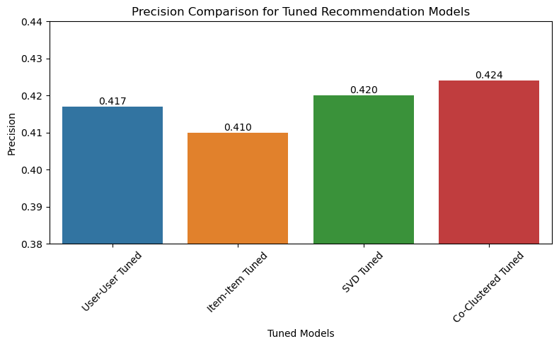
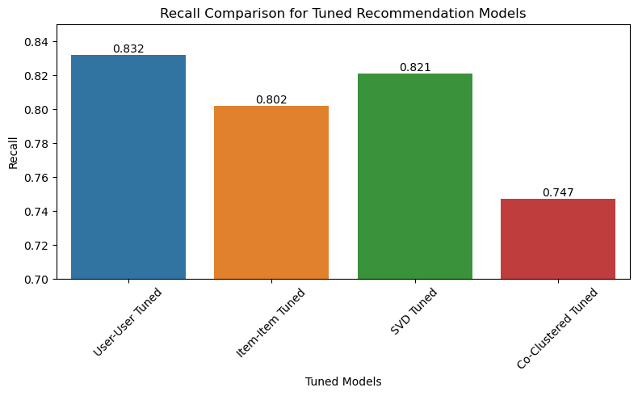
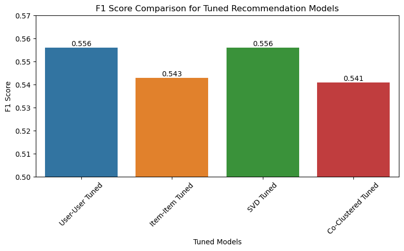

# Music Recommendation System: Model Comparison and Insights

This project was developed as the final capstone for the [Berkeley ExecEd Professional Certificate in Machine Learning and Artificial Intelligence](https://em-executive.berkeley.edu/professional-certificate-machine-learning-artificial-intelligence).

## Project Overview and Goals
This project explores how music recommendation systems can be optimized for user engagement through collaborative filtering, matrix factorization, and clustering-based models. We implemented and evaluated multiple models to identify which approaches best predict user listening behavior and balance key performance metrics such as precision, recall, and F1 score.

## Findings
Even with a significantly filtered and reduced dataset, our tuned recommendation models significantly improved performance compared to their untuned counterparts. The top-performing models were:
- **SVD Tuned** and **User-User Tuned** models consistently balanced high recall with respectable precision, **leading to the best F1 scores**.
- Co-Clustering offered decent precision but lagged slightly in recall.

Performance was evaluated through Precision, Recall, and F1 Score, shown in the figures below:

## Data Sources

- Files Used:
  - `song_data.csv`: Contains metadata about tracks, such as their IDs, titles, artist_names, releases (album name), and years the songs were published.
  - `count_data.csv`: Contains user interaction data such as user IDs, song IDs, and the count of times the song was played by those users.
- Records:
  - `song_data.csv`: ~1,000,000 songs
  - `count_data.csv`: ~2,000,000 listening events
- Key Features:
  - `song_data.csv`: `song_id`, `title`, `artist_name`, `release`, `year`
  - `count_data.csv`: `user_id`, `song_id`, `play_count`

Note: Due to the size of the dataset, it is not included in this repository. You can download the required data from the official Million Song Dataset: [http://millionsongdataset.com/](http://millionsongdataset.com/).

## Methodology
- **Preprocessing**:
  - Encoded user and song IDs
  - Filtered long-tail user and item distributions
  - Normalized play count values
- **Models Trained**:
  - **User-User Collaborative Filtering**: Recommends songs to a user based on the preferences of other users with similar behavior. It relies on finding "neighbors" with shared listening patterns.
  - **Item-Item Collaborative Filtering**: Suggests songs similar to those a user has already enjoyed. This method focuses on the similarity between items based on user interactions.
  - **SVD (Singular Value Decomposition)**: A matrix factorization technique that captures latent features of users and items, allowing more nuanced recommendations even with sparse data.
  - **Co-Clustering**: Groups both users and items simultaneously into clusters, and makes predictions based on interactions between these groups. It can uncover hidden structure in the data not captured by other methods.
- **Evaluation Techniques**:
  - **Root Mean Square Error (RMSE)**: Measures the average magnitude of prediction errors. Lower RMSE indicates better accuracy in estimating user preferences.
  - **Precision@K**: Indicates the proportion of recommended songs in the top-K list that are relevant. Higher precision means fewer irrelevant recommendations.
  - **Recall@K**: Reflects the proportion of relevant songs successfully recommended within the top-K list. Higher recall implies better coverage of user interests.
  - **F1 Score**: The harmonic mean of precision and recall. A higher F1 Score signals a strong balance between relevance and coverage.
- **Tuning**:
  - **GridSearchCV** and custom thresholds to optimize top-K performance
   
## Conclusion

This project demonstrates the strengths and trade-offs of different recommendation techniques. It shows that tuning hyperparameters significantly boosts performance, especially when optimizing for F1 Score.

The work serves as a foundation for building more nuanced, scalable, and personalized recommendation engines.

## Technologies Used

- Python, Pandas, NumPy
- Surprise Library
- Matplotlib and Seaborn for Visualization
- NLTK for basic text processing

## Contact and Further Information
- Ethan de Para
- Email: ethan.adepara@gmail.com
- [LinkedIn](https://www.linkedin.com/in/ethan-adp6816/)
